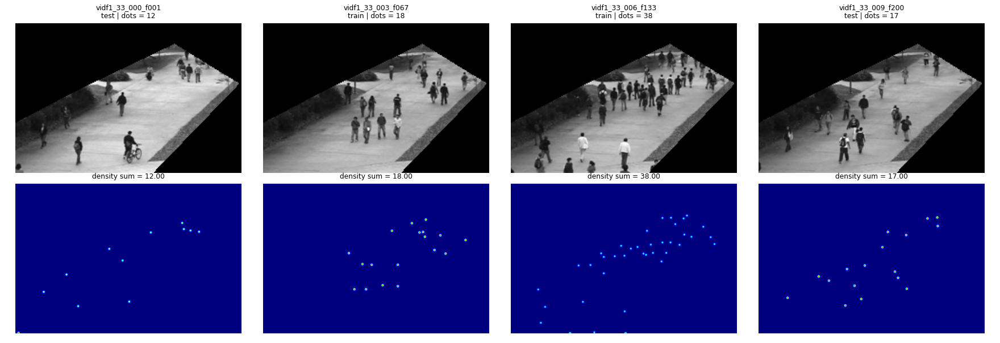

# CSRNet

A modernised PyTorch implementation of **CSRNet** (Li et al., CVPR 2018) —
"Dilated Convolutional Neural Networks for Understanding the Highly Congested
Scenes" — with dataset pipelines for **ShanghaiTech** and **UCSD**.

The original release targeted Python 2.7 / PyTorch 0.4 and no longer runs.
Every file here has been brought to Python ≥ 3.10 / PyTorch ≥ 2.2 while
keeping the algorithm identical.

## What CSRNet does

Given an image, predict how many people are in it. Rather than detecting
individuals — hopeless once heads start occluding each other — the network
regresses a **density map**: a real-valued image whose integral is the crowd
count.

- **Frontend:** the first 13 conv layers of VGG16 (transfer learning)
- **Backend:** 6 dilated conv layers (dilation 2), which widen the receptive
  field without downsampling
- **Output:** one density channel at 1/8 the input resolution
- **Loss:** MSE against a Gaussian-blurred ground-truth point map

## Layout

| Path | Role |
| --- | --- |
| [`model.py`](model.py) | the architecture (frontend + dilated backend) |
| [`image.py`](image.py) | sample loading, random crop / flip, density downsampling |
| [`dataset.py`](dataset.py) | `Dataset` over a list of image paths |
| [`train.py`](train.py) | training CLI |
| [`utils.py`](utils.py) | device selection, `AverageMeter`, checkpointing |
| [`wandb_utils.py`](wandb_utils.py) | optional Weights & Biases logging |
| [`scripts/prepare_dataset.py`](scripts/prepare_dataset.py) | ShanghaiTech → density maps + splits |
| [`scripts/prepare_ucsd.py`](scripts/prepare_ucsd.py) | UCSD → density maps + splits |
| [`scripts/evaluate.py`](scripts/evaluate.py) | evaluate a checkpoint on a split |
| [`slurm_scripts/`](slurm_scripts/) | SLURM pipeline: setup → prepare → train → evaluate |
| [`UCSD_GUIDE.md`](UCSD_GUIDE.md) | the UCSD dataset, its preprocessing, and why |

Datasets, generated ground truth, split JSONs and checkpoints are **not** in
the repo — they are downloaded and rebuilt by the commands below.

## Quick start

```bash
python -m venv .venv && .venv/Scripts/activate    # Windows
pip install -r requirements.txt
```

### ShanghaiTech

```bash
python scripts/prepare_dataset.py --dataset-root ShanghaiTech_Crowd_Counting_Dataset \
                                  --output-dir data_splits --part A

python train.py --train-json data_splits/part_A_train.json \
                --val-json   data_splits/part_A_val.json \
                --task checkpoints/partA/partA_ --device cuda --amp
```

### UCSD

```bash
mkdir -p UCSD_Crowd_Counting_Dataset/raw && cd UCSD_Crowd_Counting_Dataset/raw
curl -O http://www.svcl.ucsd.edu/projects/peoplecnt/db/ucsdpeds.zip
curl -O http://www.svcl.ucsd.edu/projects/peoplecnt/db/vidf-cvpr.zip
cd ../..

python scripts/prepare_ucsd.py --dataset-root UCSD_Crowd_Counting_Dataset \
                               --output-dir data_splits

python train.py --train-json data_splits/ucsd_train.json \
                --val-json   data_splits/ucsd_val.json \
                --task checkpoints/ucsd/ucsd_ \
                --gt-downsample area --optimizer adam --lr 1e-5 \n                --lr-schedule cosine --clip-grad 5 \n                --batch-size 16 --device cuda --amp
```



Every UCSD frame is the same size, so batches larger than 1 work — unlike
ShanghaiTech, whose images vary in resolution and need `--batch-size 1`.

Or run the whole comparison — two kernel widths x optimiser x augmentation,
all reporting into one Weights & Biases group:

```bash
WANDB_API_KEY=... ./slurm_scripts/11_submit_ucsd_sweep.sh
```

**Batch size and learning rate.** `--loss-norm batch-mean` (the default)
divides the summed squared error by `2N`, which is the loss the CSRNet paper
actually defines. It matters: under the old unnormalised `sum`, the gradient
grew linearly with the batch — measured at 13.7 for batch 1 and 264.5 for
batch 16 — so a learning rate tuned at batch 1 took roughly 19x larger steps
at batch 16 and the loss climbed instead of falling. With `batch-mean` the
gradient norm stays near 10 across batch sizes, so lr is yours to set
independently of the batch.

### Evaluate

```bash
python scripts/evaluate.py --json data_splits/ucsd_test.json \
                           --checkpoint checkpoints/ucsd/ucsd_model_best.pth.tar \
                           --gt-downsample area
```

### On a SLURM cluster

```bash
PART=A    ./slurm_scripts/10_submit_csrnet_pipeline.sh
PART=UCSD ./slurm_scripts/10_submit_csrnet_pipeline.sh
```

Submits setup → prepare → train → evaluate as a dependency chain.

## `--gt-downsample`

`image.py` shrinks the density map to the network's 1/8 output stride and
multiplies by 64. `cubic` (the default, matching the original recipe) *samples*
the density rather than integrating it, so with tight kernels the target count
drifts by a couple of percent per frame. `area` averages each 8×8 block, which
restores the count exactly.

Use `cubic` for ShanghaiTech, `area` for UCSD — and pass the **same** flag to
`scripts/evaluate.py` that you used for training, since the metric is computed
against the downsampled target. [`UCSD_GUIDE.md`](UCSD_GUIDE.md) has the
measurements behind this.

## Reference

Yuhong Li, Xiaofan Zhang, Deming Chen. *CSRNet: Dilated Convolutional Neural
Networks for Understanding the Highly Congested Scenes.* CVPR 2018.
[arXiv:1802.10062](https://arxiv.org/abs/1802.10062)

Datasets: [ShanghaiTech](https://github.com/desenzhou/ShanghaiTechDataset) ·
[UCSD](http://www.svcl.ucsd.edu/projects/peoplecnt/index.htm)
